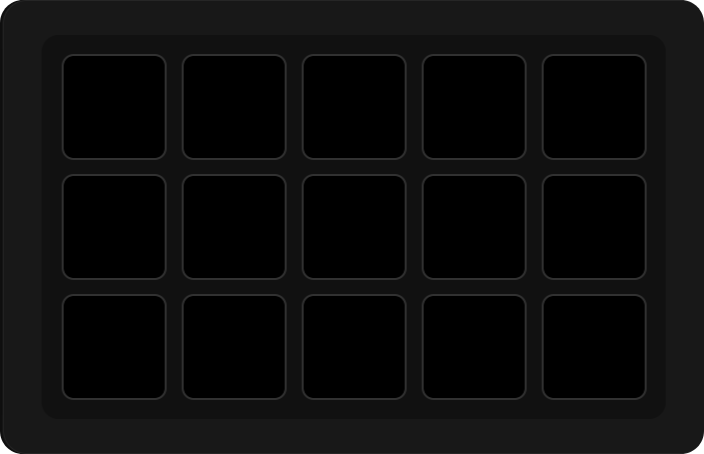

# Your first button

PyDeck is installed and running — now let's make a button *do* something. This takes about two minutes and assumes you've finished the **[install](install.md)** step and can open [http://localhost:8686](http://localhost:8686).

## 1. Open the deck

Open **[http://localhost:8686](http://localhost:8686)** in your browser. You'll see a grid that mirrors your Stream Deck. Each square in the browser is one physical key.

{ .pd-shot }

!!! tip "First run: the welcome screen"
    A fresh install opens with a welcome screen that introduces the app, and offers a
    short **guided tour** of the sidebar, the grid, and the properties panel. Take it
    or skip it — you can't get it wrong. The "seen" flag is stored in PyDeck's own
    config rather than the browser, so a reinstall introduces itself again even in a
    browser that has already seen it.

If you have more than one Stream Deck plugged in, use the **device switcher** to choose which one you're editing. See [Devices](../using/devices.md) for more.

## 2. Pick a key

Click any square in the grid. The properties panel on the right opens for that key. You have two kinds of things to put on a button:

- **An action** — a sequence you build yourself out of plugin functions, delays, and image/text/colour changes. Actions are part of PyDeck; no installation required.
- **A plugin function** — a single button from a plugin you've installed (Spotify play/pause, a live clock, a Home Assistant toggle…).

We'll do one of each.

!!! note "On a phone or a narrow window"
    The three-column layout collapses: the sidebar becomes a drawer and the properties
    panel a bottom sheet, both reached from the header toggles. Drag-and-drop gives way
    to tapping — tap a deck button to configure it.

## 3a. Make an action button

1. In the sidebar, open the **Actions** category and drag **New Action** onto an empty key. The window switches into builder mode.
2. Give the action a **Name** at the top — that name is how it is identified everywhere else.
3. Drag a plugin function from the sidebar into the step list, then click the step to configure it in the right-hand panel.
4. **Save Action**.

Now **press the physical key**. The action runs. (Clicking an action key in the web UI opens the builder instead of firing it, so it is safe to click.)

Actions can chain several steps, wait between them, and alternate on each press — see the **[Action Builder](../using/actions.md)** for the full toolkit.

## 3b. Add a plugin button

PyDeck ships with no plugins, so first install one:

1. Open the **Marketplace** from the sidebar.
2. Find a simple plugin — the **Clock** is a good first one — and click **Install**.
3. Go back to the deck, find the plugin in the sidebar, and drag one of its **functions** onto a key (for the clock, a clock face).
4. Fill in any options the function offers, then save. The button starts updating on its own.

Full details are in **[Install plugins & themes](../using/marketplace.md)**.

## 4. Organize as you grow

Once you've got a few buttons, these features help you fit more onto the deck than you have keys:

- **[Profiles](../using/profiles-and-folders.md)** — whole layouts you switch between (work vs. gaming).
- **[Folders](../using/profiles-and-folders.md)** — a key that opens a sub-page of more keys.
- **[Themes](../using/appearance.md)** — restyle the whole UI.

## What next?

- **[Using PyDeck](../using/devices.md)** — the full feature tour.
- **[Build your own plugin](../plugins/getting-started.md)** — when the marketplace doesn't have what you want.
- **[Troubleshooting](troubleshooting.md)** — if something isn't working.
