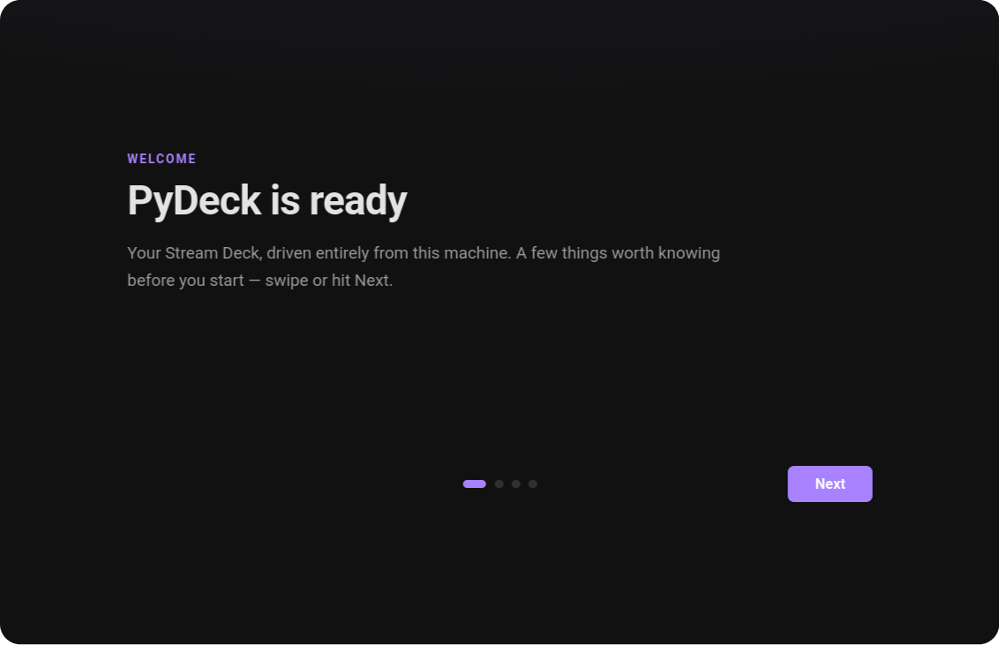

# Install PyDeck

This page gets **PyDeck** running on your computer. It takes a few minutes and works on **Linux**, **macOS**, and **Windows**. When you're done, PyDeck runs in the background and you control it from your browser.

!!! tip "In a hurry?"
    Install, then open **[http://localhost:8686](http://localhost:8686)** in any browser. That's the whole app — there's nothing else to open.

## Before you start

You need three things:

- **A supported Stream Deck** (see [the list below](#supported-hardware)).
- **Python 3.10 or newer.** Most systems already have it — the installer checks for you.
- **An internet connection**, so the installer can download PyDeck and its dependencies.

That's it. The installer handles everything else: it downloads PyDeck, creates an isolated Python environment, installs what PyDeck needs, copies default settings into place, and sets PyDeck to start automatically.

## Install

The installer downloads PyDeck for you — there is nothing to clone first. Pick your operating system.

=== "Linux"

    ```bash
    curl -fsSL https://www.pydeck.no/install.sh | sudo bash
    ```

    The installer will:

    1. Download PyDeck to `/opt/pydeck` (owned by your user, so the in-app updater works without root).
    2. Check your Python version (3.10+).
    3. Create a virtual environment and install dependencies.
    4. **Optionally** install *udev rules* so PyDeck can talk to the Stream Deck without running as root (recommended — see [the note below](#linux-permissions)).
    5. Detect your init system (systemd, OpenRC, runit, s6, Upstart, or SysV) and create a service so PyDeck starts at boot.
    6. Offer to start PyDeck right away.

=== "macOS"

    Run the **same** installer, but **without** `sudo`:

    ```bash
    curl -fsSL https://www.pydeck.no/install.sh | bash
    ```

    PyDeck lands in `~/.local/opt/pydeck`, and the installer registers a per-user *LaunchAgent* (`~/Library/LaunchAgents/com.pydeck.agent.plist`) so PyDeck starts when you log in. No extra permissions are needed — macOS grants HID access to user apps automatically. Logs are written to `~/Library/Logs/PyDeck/`.

    Running it as `root` is refused: LaunchAgents are per-user.

=== "Windows"

    From PowerShell — **no administrator rights needed**:

    ```powershell
    irm https://www.pydeck.no/install.ps1 | iex
    ```

    PyDeck lands in `%LOCALAPPDATA%\Programs\PyDeck`. The installer creates a virtual environment, copies default settings to `%USERPROFILE%\.config\pydeck\core\`, and registers a **Task Scheduler** entry named *PyDeck* that starts at logon (falling back to a Startup-folder shortcut if Task Scheduler is unavailable). No extra setup is needed — Windows sees the Stream Deck as a standard device.

Once the installer finishes, open **[http://localhost:8686](http://localhost:8686)**. On a fresh install PyDeck greets you with a welcome screen and offers a short guided tour of the sidebar, the deck grid, and the properties panel.

{ .pd-shot }

### Where PyDeck is installed

| Platform | Default directory |
|---|---|
| Linux | `/opt/pydeck` |
| macOS | `~/.local/opt/pydeck` |
| Windows | `%LOCALAPPDATA%\Programs\PyDeck` |

Your settings and layouts live somewhere else entirely — see [Config & file paths](../reference/paths.md). Reinstalling or removing the program directory never touches them.

!!! tip "Install with `git` if you can"
    The installer clones with `git` when it is available, which is what the in-app
    updater (**Settings → Updates**) needs to pull new versions and check out release
    tags. Without `git` it falls back to downloading a source archive, and updating
    then means re-running the installer.

### Installer options

=== "Linux / macOS"

    | Option | Description |
    |---|---|
    | `--dir <path>` | Install somewhere other than the default |
    | `--ref <ref>` | Install a specific branch or release tag (default: `main`) |
    | `--with-udev` / `--no-udev` | Decide the udev rules without being asked (Linux) |
    | `--no-service` | Skip service / autostart registration |
    | `-y`, `--yes` | Answer yes to every prompt (non-interactive) |
    | `--ssh` | Clone over SSH instead of HTTPS |
    | `--token <token>` | Authenticate the download with a GitHub token |

    A piped install passes options after `bash -s --`:

    ```bash
    curl -fsSL https://www.pydeck.no/install.sh | sudo bash -s -- --yes --with-udev
    ```

=== "Windows"

    | Option | Description |
    |---|---|
    | `-InstallDir <path>` | Install somewhere other than the default |
    | `-Ref <ref>` | Install a specific branch or release tag (default: `main`) |
    | `-Yes` | Answer yes to every prompt (non-interactive) |
    | `-SkipAutostart` | Don't register autostart |
    | `-Force` | Replace an existing PyDeck scheduled task without asking |
    | `-Ssh` | Clone over SSH instead of HTTPS |
    | `-Token <token>` | Authenticate the download with a GitHub token |

    A piped install (`irm | iex`) can't take parameters, so use the environment
    instead: `$env:PYDECK_DIR`, `$env:PYDECK_REF`, `$env:PYDECK_GITHUB_TOKEN`.

### Installing from a checkout

Run an installer from inside a PyDeck checkout and it installs **that tree** instead of downloading anything — handy if you're working on PyDeck itself:

=== "Linux / macOS"

    ```bash
    git clone https://github.com/opvault/pydeck.git
    cd pydeck
    sudo bash install.sh        # macOS: bash install.sh
    ```

=== "Windows"

    ```powershell
    git clone https://github.com/opvault/pydeck.git
    cd pydeck
    powershell -ExecutionPolicy Bypass -File .\install.ps1
    ```

## Supported hardware

PyDeck recognizes these Elgato Stream Deck models:

| Model | Buttons | Layout |
|---|---|---|
| Stream Deck Mini | 6 | 3 × 2 |
| Stream Deck Mini MK2 | 6 | 3 × 2 |
| Stream Deck MK2 | 15 | 5 × 3 |
| Stream Deck Original V2 | 15 | 5 × 3 |
| Stream Deck XL | 32 | 8 × 4 |
| Stream Deck XL V2 | 32 | 8 × 4 |

No Stream Deck? You can still try PyDeck with a **[virtual deck](../using/virtual-decks.md)** — a software deck you control from the browser, a phone, or a spare screen.

See **[Devices](../using/devices.md)** for switching between multiple decks, brightness, and orientation.

## Running manually

If you didn't enable autostart, or you want to run PyDeck in a terminal to watch its output, run the start script from your install directory:

=== "Linux / macOS"

    ```bash
    bash /opt/pydeck/pydeck-start.sh          # macOS: ~/.local/opt/pydeck/pydeck-start.sh
    ```

=== "Windows"

    ```powershell
    powershell -ExecutionPolicy Bypass -File "$env:LOCALAPPDATA\Programs\PyDeck\pydeck-start.ps1"
    ```

Then open [http://localhost:8686](http://localhost:8686).

## Linux permissions

On Linux, talking to USB devices normally requires elevated privileges. PyDeck ships optional **udev rules** that grant your user access to the Stream Deck, so PyDeck doesn't have to run as root.

The installer offers to set these up for you. To install them non-interactively, pass `--with-udev`; to skip, pass `--no-udev`. If you skip them, PyDeck must run as root to see the device.

## Updating

Re-run the installer and it updates the existing install in place — refreshing the source, the virtualenv, and the service files:

```bash
sudo bash /opt/pydeck/install.sh          # Linux
bash ~/.local/opt/pydeck/install.sh       # macOS
```

Most of the time you won't need to: PyDeck updates itself from **Settings → Updates**. See [Updating PyDeck](../using/updates.md).

## Uninstalling

Run the uninstaller from your install directory:

=== "Linux"

    ```bash
    sudo bash /opt/pydeck/uninstall.sh
    ```

=== "macOS"

    ```bash
    bash ~/.local/opt/pydeck/uninstall.sh
    ```

=== "Windows"

    ```powershell
    powershell -ExecutionPolicy Bypass -File "$env:LOCALAPPDATA\Programs\PyDeck\uninstall.ps1"
    ```

This removes PyDeck's autostart entry, the udev rules (Linux), and the virtual environment. It asks before removing your settings and logs — nothing personal is deleted without confirmation.

## Next steps

- **[Press your first button](first-button.md)** — a two-minute walkthrough.
- **[Install plugins & themes](../using/marketplace.md)** — add Spotify, Home Assistant, Discord, and more.
- Something not working? **[Troubleshooting](troubleshooting.md)**.
