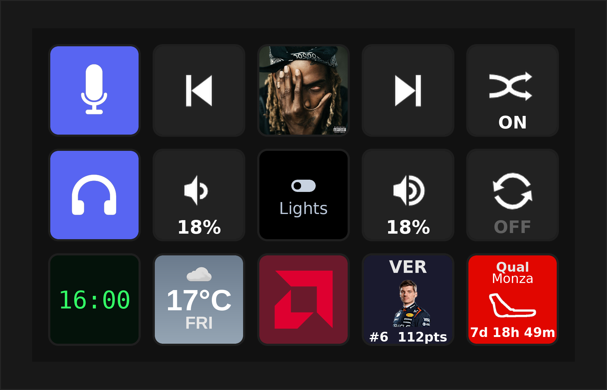

---
hide:
  - navigation
  - toc
---

# PyDeck

A Python-powered controller for your Elgato Stream Deck. Runs in your browser, extends with plugins and themes, and even turns a phone or spare screen into a deck.

[Install PyDeck](get-started/install.md){ .md-button .md-button--primary }
[Build a plugin](plugins/getting-started.md){ .md-button }

{ .pd-shot .pd-shot--hero }

## What is PyDeck?

PyDeck is a lightweight web app that drives an [Elgato Stream Deck](get-started/install.md#supported-hardware). It runs on **Linux, macOS, and Windows**, installs with a single command, serves a browser UI at `http://localhost:8686`, and talks to the hardware over USB. Buttons can run built-in **actions** or **plugins** you install from the marketplace — and you can restyle the whole UI with **themes**.

Unlike Elgato's software, PyDeck ships with **no built-in plugins** and a single built-in theme. Everything else is added from the marketplace or built by you, which keeps the core small and puts you in control.

## Private by default

**No account. No sign-up. No telemetry.** PyDeck runs entirely on your own machine — your buttons, profiles, and settings never leave it. There is nothing to log into and nothing phoning home with your data.

The only time the **core** reaches the internet is on your terms: to browse and install from the marketplace (files hosted on GitHub) and to check for updates. That's it — no analytics, no tracking.

It doesn't listen on the network either, unless you ask it to. PyDeck binds to `127.0.0.1` by default, and even with LAN access turned on for phone control, remote requests are **denied by default** — a device has to be paired, and the editor and settings stay reachable only from the machine itself.

!!! note "Plugins you install are their own thing"
    A plugin you choose to add may talk to an outside service to do its job — the Spotify plugin uses Spotify's API, Discord uses Discord's, Home Assistant talks to your own server, and so on. That traffic is between that plugin and that service, governed by their terms, not PyDeck's. The core neither requires it nor sees it — install only the plugins whose services you're happy to use.

## Where to next

-   :material-download: **Get Started**

    ---

    Install PyDeck on your computer and press your first button in a couple of minutes.

    [:octicons-arrow-right-24: Install PyDeck](get-started/install.md)

-   :material-tune: **Using PyDeck**

    ---

    Devices, profiles, folders, the Action Builder, phone control, and the marketplace.

    [:octicons-arrow-right-24: Using PyDeck](using/devices.md)

-   :material-puzzle: **Build Plugins**

    ---

    Write your own buttons with the PDK template engine — templates, rendering, and a Python runtime.

    [:octicons-arrow-right-24: Build a plugin](plugins/getting-started.md)

-   :material-palette: **Build Themes**

    ---

    Restyle the PyDeck UI with a handful of CSS variables and publish to the theme catalog.

    [:octicons-arrow-right-24: Build a theme](themes/getting-started.md)

-   :material-api: **Reference**

    ---

    The full HTTP & WebSocket API, config and file-path layout, and a glossary of PyDeck terms.

    [:octicons-arrow-right-24: API reference](reference/http-api.md)

-   :material-source-repository: **Source code**

    ---

    PyDeck is open source. The app, plugin catalog, and theme catalog each live in their own repo.

    [:octicons-arrow-right-24: PyDeck on GitHub](https://github.com/opvault/pydeck)

