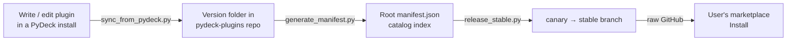

# Publishing to the catalog

This page is for **catalog maintainers** — the people who publish plugins to the marketplace that other users install. If you just want to *use* plugins, see [Install plugins & themes](../using/marketplace.md); if you're *writing* one, start with [Getting started](getting-started.md).

## How the marketplace is wired

PyDeck's marketplace is two independent GitHub repos plus the app:

- **[`opvault/pydeck`](https://github.com/opvault/pydeck)** — the app running on the user's machine. Installed plugins land under `~/.local/share/pydeck/plugin/<id>/` (honoring `$XDG_DATA_HOME`), **not** inside the checkout.
- **[`opvault/pydeck-plugins`](https://github.com/opvault/pydeck-plugins)** — the plugin catalog: a static file store with a root `manifest.json` index and one folder per plugin version. No code runs here.
- **[`opvault/pydeck-themes`](https://github.com/opvault/pydeck-themes)** — the theme catalog, same shape. See [Publishing themes](../themes/publishing.md).

The app reads the root `manifest.json` over raw GitHub, then downloads a version folder straight into the plugin directory.



## Release channels

The `testing`, `canary`, and `stable` branches are **parallel channels of the same catalog** — they differ only by the `label` field in `manifest.json`. Users pick a channel in the marketplace UI.

| Channel | Branch | Label | Purpose |
|---|---|---|---|
| Testing | `testing` | `Testing` | Active development line |
| Canary | `canary` | `Canary` | Pre-release verification |
| Stable | `stable` | `Stable` | What most users run |

Promotion flows **testing → canary → stable**.

!!! danger "Always pass `--label`"
    `generate_manifest.py` defaults to `Testing`. Running it unqualified on `canary` or `stable` silently **demotes** the channel's label. Every command below passes an explicit `--label`.

!!! warning "The label names the channel, not the publisher"
    Don't put "Official" in the label. PyDeck decides for itself whether a catalog is
    official, from the **URL it was configured with** — a `pydeck.no` host, or a
    `raw.githubusercontent.com` URL under `OPvault` — and never from anything the
    manifest claims, since a catalog vouching for its own officialness would be trivially
    forged. The badge is rendered separately from the channel label.

## The three metadata files

Three different files carry plugin metadata. Mixing them up is the most common catalog mistake:

| File | Where | Purpose | Edited by |
|---|---|---|---|
| `<version>/manifest.json` | inside each version | **Source of truth** — name, version, functions, permissions, etc. | plugin author |
| `<slug>/catalog.json` | plugin root | Catalog-only overrides: `category`, `compatible_pydeck_versions`, `summary`, `licenses`, `compatibility` | maintainer |
| `<version>/meta/options.json` | inside each version | Marketplace blurb: `description`, `features[]`, `tags[]` | plugin author |
| `manifest.json` (root) | repo root | The generated catalog index | **never by hand** |

The root index is regenerated from the other three — see [Regenerating the manifest](#regenerating-the-manifest). Field precedence for catalog-only fields is **`catalog.json` > previous root manifest > default**, so deleting the root manifest loses any `category`/`summary`/`licenses` that only ever lived in the old index.

---

## The normal workflow: sync from a PyDeck install

Syncs plugin source files from a local `pydeck` checkout into the `pydeck-plugins` catalog repo, automatically detecting changes, bumping patch versions, and regenerating the root `manifest.json`.

---

### Overview

`sync_from_pydeck.py` lives at the root of the `pydeck-plugins` repo. It bridges the development repo (`pydeck`) and the catalog repo (`pydeck-plugins`):

```text
~/.local/share/pydeck/plugin/<rdnn-id>/   →   pydeck-plugins/plugins/<rdnn-id>/<version>/
           (source of truth)                           (catalog, versioned)
```

`<rdnn-id>` is the reverse-DNS plugin id (install folder name), e.g. `no.pydeck.spotify`.

Use **`$XDG_DATA_HOME/pydeck/plugin/`** when `XDG_DATA_HOME` is set. Legacy checkouts may still use **`pydeck/plugins/plugin/`** until PyDeck migrates them on first start.

On each run it:

1. Scans every plugin directory in the pydeck source.
2. Compares source files against the latest version already in the catalog repo.
3. Skips plugins where nothing has changed.
4. For changed plugins, bumps the version (or uses the source version if it is already higher), copies the files into a new version folder, and updates the version in the source `manifest.json`.
5. Runs `generate_manifest.py` to regenerate the root `manifest.json`.

---

### Prerequisites

- Python 3.10+
- A local clone of the `pydeck` repo (the main app repo, not the catalog)
- Both repos checked out on the correct branches

---

### Usage

```bash
python sync_from_pydeck.py
```

On first run the script auto-detects the pydeck source path and asks you to confirm it. The confirmed path is saved to `~/.config/pydeck/pydeck-plugins/path.json` so subsequent runs need no input.

---

### Options

| Flag | Description |
|:---|:---|
| `--pydeck-source PATH` | Override the saved source path for this run only. Points to the **plugin root** (`~/.local/share/pydeck/plugin/` by default, or legacy `pydeck/plugins/plugin/`). |
| `--plugin SLUG` | Sync (or list) only this plugin. Repeatable — pass it once per slug. |
| `--list-plugins` | Print every source plugin with a **NEW** / **CHANGED** / **UNCHANGED** status, then exit without writing anything. |
| `--dry-run` | Show what would happen without writing any files. The diff is still printed. |
| `--no-diff` | Suppress the coloured per-file diff (shown by default for every changed plugin). |
| `--no-generate` | Skip running `generate_manifest.py` after syncing. |
| `--yes` | Accept the auto-detected or saved source path without prompting. |
| `--regen-conf` | Re-prompt for the source path and overwrite the saved config. |
| `--changelog TEXT` | A bullet for the new version's changelog section. Repeatable. Without it you are prompted; decline the prompt and a placeholder line is written. |
| `--no-changelog` | Leave `CHANGELOG.md` untouched entirely. |

!!! note "Pair `--changelog` with `--plugin`"
    The changelog flags apply to **every** plugin in the run, so scope the run to one
    plugin when you use them.

### Changelogs are written, never diffed

Publishing a version also brings its `CHANGELOG.md` up to date:

- The **live install's** copy wins; the previous repo version supplies the history when the install has none.
- A section for the new version is prepended unless one is already there.
- The result is written into **both** the new version folder and the live install.

The changelog is deliberately excluded from change detection: a file only the repo has must
not read as a deletion, and a changelog edit on its own is not a reason to publish a new
version. The consequence is that **hand-editing a `CHANGELOG.md` inside a version folder
does not propagate back to your install** — edit the install's copy, or pass `--changelog`.

---

### Source Path Config

The confirmed source path is stored at:

```text
~/.config/pydeck/pydeck-plugins/path.json
```

```json
{
  "pydeck_source": "/home/user/.local/share/pydeck/plugin"
}
```

Auto-detection checks these candidate paths in order:

1. `~/.local/share/pydeck/plugin`
2. `~/Documents/GitHub/pydeck/plugins/plugin` (legacy checkout layout)
3. `<catalog-repo-parent>/pydeck/plugins/plugin`
4. `~/pydeck/plugins/plugin`

Use `--regen-conf` to update the saved path, or `--pydeck-source` to override it for a single run.

---

### Sync Workflow

For each plugin directory found in the pydeck source:

#### New plugin (slug not in catalog repo)

The source `manifest.json` version is used as-is. All source files are copied into `plugins/<slug>/<version>/`.

#### Existing plugin — no changes

Skipped. The output line reads:

```text
  SKIP    spotify  (unchanged, latest=1.1.0)
```

#### Existing plugin — files changed, source version ≤ repo version

The patch segment of the repo version is incremented (e.g. `1.1.0` → `1.1.1`). The source `manifest.json` is updated in-place with the new version string, then all files are copied into `plugins/<slug>/1.1.1/`.

```text
  UPDATE  spotify  →  plugins/spotify/1.1.1  (bumped 1.1.0 → 1.1.1)
```

#### Existing plugin — source version already higher than repo

The source version is used without further bumping. Files are copied into `plugins/<slug>/<src_version>/`.

```text
  UPDATE  spotify  →  plugins/spotify/1.2.0  (source version 1.2.0 > repo 1.1.0)
```

#### After all plugins

`generate_manifest.py` is run automatically (unless `--no-generate` is passed) to keep the root `manifest.json` current.

---

### Version Bumping Rules

| Condition | Action |
|:---|:---|
| Source version == repo latest | Bump patch: `1.1.0` → `1.1.1` |
| Source version < repo latest | Bump patch from repo version |
| Source version > repo latest | Use source version as-is |

The source `manifest.json` is always updated to match the final version before the files are copied, so the file inside the new version folder always shows the correct version.

The update uses a targeted string replacement (`"version": "x.y.z"` → `"version": "x.y.z+1"`) that preserves the rest of the file's JSON formatting exactly, preventing false positives on the next sync run.

---

### Change Detection

Files are compared between the pydeck source directory and the latest version folder in the catalog repo. A change is detected when:

- A file exists in the source but not in the latest version folder (new file).
- A file exists in the latest version folder but not in the source (deleted file).
- A file exists in both but the contents differ.

#### JSON files

`.json` files (including `manifest.json`) are compared **semantically** — the parsed Python objects are compared, not the raw bytes. This means differences in whitespace, indentation, or key ordering do not count as changes.

#### Other files

All other files are compared byte-for-byte using `filecmp.cmp` with `shallow=False`.

#### Ignored files

See [Files That Are Always Ignored](#files-that-are-always-ignored).

---

### Diff Output

When a plugin has changes, a coloured unified diff is printed before the update line — similar to `git diff`:

```diff
diff  home-assistant  (1.1.0 → new)
--- a/ha_client.py
+++ b/ha_client.py
@@ -34,7 +34,9 @@
     _HAS_CAIROSVG = False

 _PLUGIN_DIR = Path(__file__).parent
-_IMG_DIR = _PLUGIN_DIR / "img"
+# Runtime-generated icons — prefer ctx.storage_path (~/.local/share/pydeck/storage/<plugin>/)
+_STORAGE_DIR = Path.home() / ".local" / "share" / "pydeck" / "storage" / "home-assistant"

 BUTTON_SIZE = 80
```

| Line prefix | Meaning |
|:---|:---|
| `-` (red) | Line present in the current repo version, removed in the new version |
| `+` (green) | Line added in the new version |
| (dim) | Context lines (unchanged, shown for reference) |

New files print a single green notice: `new file: src/shared.py  (264 lines)`.  
Deleted files print a single red notice: `deleted file: old_helper.py  (40 lines)`.  
Binary files print: `binary file changed: icon.png`.

Suppress with `--no-diff`.

---

### Files That Are Always Ignored

The following files are excluded from both change detection and copying, because they belong to the catalog repo and are not part of the versioned plugin source:

| File | Reason |
|:---|:---|
| `catalog.json` | Catalog-only metadata, managed in the catalog repo |
| `icon.svg` / `icon.png` | Plugin icon, lives at the slug root, not in version folders |
| `license.txt` / `lisence.txt` / `LICENSE` / `LICENSE.txt` / `LICENSE.md` | License files downloaded by pydeck alongside the plugin source; not versioned |

Python cache files (`__pycache__/`, `*.pyc`, `*.pyo`) are also excluded from both comparison and copying.

---

### Examples

#### See what would change, without syncing

```bash
python sync_from_pydeck.py --list-plugins
```

#### Standard sync

```bash
python sync_from_pydeck.py
```

#### Sync a single plugin

```bash
python sync_from_pydeck.py --plugin no.pydeck.spotify
python sync_from_pydeck.py --plugin no.pydeck.spotify --plugin no.pydeck.clock
```

#### Preview changes without writing anything

```bash
python sync_from_pydeck.py --dry-run
```

#### Sync without the coloured diff

```bash
python sync_from_pydeck.py --no-diff
```

#### Non-interactive sync (CI / scripted)

```bash
python sync_from_pydeck.py --yes --no-generate
```

#### Override the source path for one run

```bash
python sync_from_pydeck.py --pydeck-source ~/.local/share/pydeck/plugin
```

#### Re-configure the saved source path

```bash
python sync_from_pydeck.py --regen-conf
```

---

## Regenerating the manifest

Regenerates the root `manifest.json` for the `pydeck-plugins` catalog repo by scanning the `plugins/` directory tree. Run it any time you add, remove, or update a plugin version.

---

### Overview

`generate_manifest.py` lives at the root of the `pydeck-plugins` repo. When run, it:

1. Scans every subdirectory of `plugins/` to find plugin ids (each folder name is the catalog **slug**, normally an **RDNN** id such as `no.pydeck.spotify`).
2. Inside each plugin directory, finds all semver-named version subdirectories (e.g. `1.0.0`, `1.1.0`).
3. Reads each version's `manifest.json` to extract per-version fields.
4. Reads an optional per-plugin `catalog.json` for catalog-only metadata.
5. Falls back to the existing root `manifest.json` for any fields not covered by the above.
6. Writes a new root `manifest.json` with all plugins sorted alphabetically by name.

This means you almost never need to hand-edit `manifest.json` — just add your version folder and run the script.

---

### Usage

```bash
python generate_manifest.py
```

Run from the repo root. No arguments are required for a standard regeneration.

---

### Options

| Flag | Default | Description |
|:---|:---|:---|
| `--label TEXT` | `"Testing"` | The `label` field written into the root manifest. Appears as a channel badge in PyDeck's marketplace UI. |
| `--root-url URL` | the raw URL of the **checked-out branch** | The base that every entry path in the manifest resolves against. See [below](#root_url-where-a-catalogs-files-actually-live). |
| `--output PATH` | `manifest.json` | Where to write the output. Useful for previewing output to a different file. |
| `--dry-run` | off | Print the generated JSON to stdout without writing any file. |

!!! warning "Always pass `--label` on `canary` and `stable`"
    The default is `"Testing"`. Running the script unqualified while on the
    `canary` or `stable` branch silently demotes that channel's label. See
    [Promoting a release](#promoting-a-release-canary-to-stable) for the channel model.

### `root_url` — where a catalog's files actually live

Everything in the manifest is a **repo-relative** path: `icon_path`, each version's
`path`, `doc_path`, `changelog_path`. Something has to say what they are relative to.

The obvious answer — trim the last segment off the manifest URL — is only right for a
manifest served out of the repo that holds the files. The official catalogs are fetched
from `https://plugins.pydeck.no`, a vanity host that redirects; trimming that yields
`https://` with no repo in it. So the manifest states its base outright:

```json
{
  "schema_version": 1,
  "label": "Testing",
  "root_url": "https://raw.githubusercontent.com/OPvault/pydeck-plugins/testing/",
  "generated_at": "…"
}
```

The generator defaults `--root-url` to the raw URL of the branch you are standing on,
derived from `origin` and `git rev-parse --abbrev-ref HEAD`.

!!! danger "Generating for a branch you are not on needs an explicit `--root-url`"
    The default reads the *checked-out* branch. Regenerating the stable manifest while
    standing on canary — which is exactly what `release_stable.py` step 1 does — would
    otherwise stamp canary's URL onto stable. That script passes both roots explicitly;
    do the same if you drive the generator by hand.

PyDeck falls back to the manifest's own directory when `root_url` is absent, so an older
catalog served from its repo still works.

---

### Discovery Logic

#### Version directories

A subdirectory is treated as a version directory if:
- Its name contains at least one `.`
- Every segment separated by `.` is a digit (e.g. `1.0.0`, `2.1`, `1.0.1`)
- It contains at least one file, anywhere below it

Non-matching directories (like `img/`, `__pycache__/`) are ignored.

!!! danger "Empty version directories are deleted"
    Before scanning, the script **removes from disk** any semver-named directory under
    `plugins/` that holds no files at all, printing a `PURGE` line for each. A version
    folder you created but have not populated yet will not survive a regeneration.

#### Version ordering

Version directories are sorted by their semver tuple (`1.0.0` < `1.0.1` < `1.1.0`). The highest version becomes `latest`.

#### Per-version fields

From each version's `manifest.json`:

| Field read | Written to root manifest as |
|:---|:---|
| `name` | `name` (latest version wins) |
| `description` | `summary` (fallback only — see priority below) |
| `author` | `author` (latest version wins) |
| `min_pydeck_version` | `versions[].min_pydeck_version` (`"1.0.0"` when the key is absent) |
| `max_pydeck_version` | `versions[].max_pydeck_version` (`"1.0.0"` when the key is absent) |
| `documentation` (latest version) | `doc_path` (repo-relative path to the markdown file) |
| `show_markdown_after_install` (latest version) | `show_markdown_after_install` |
| `changelog` (every version, default `CHANGELOG.md`) | `versions[].changelog_path` (repo-relative path to that version's changelog) |

!!! warning "An absent `max_pydeck_version` pins the plugin"
    Only a *missing key* falls back to `"1.0.0"` — an explicit `"max_pydeck_version": null`
    is copied through as `null` and leaves the range open. Omitting the field entirely
    caps the plugin at PyDeck 1.0.0, which is rarely what you want.

If the **latest** version's `manifest.json` declares a `documentation` file, the
plugin entry also gets a `doc_path` (e.g. `plugins/discord/1.1.4/DOCS.md`) plus the
`show_markdown_after_install` flag, so the marketplace can fetch and render the doc.
See [Plugin documentation](documentation.md).

Every version folder is also probed for a changelog, which becomes that version's
`changelog_path` inside `versions`. The `changelog` manifest key names the file;
`CHANGELOG.md` is picked up by name when the key is absent, so a plugin gets a
changelog entry without declaring anything.

A version's changelog holds **only that version's own changes**, so PyDeck
assembles what it needs by fetching one file per version and joining them
newest-first — the update badge fetches every version above the one installed,
the changelog button fetches them all. A version with no changelog is skipped,
so coverage does not have to be complete.

#### Icon detection

The script checks the plugin slug directory for icons in this priority order:

1. `icon.svg`
2. `icon.png`

The first match becomes `icon_path`. If neither exists, a warning is printed and `icon_path` is set to `""`.

#### Platform compatibility

`compatibility` is lifted from the **latest** version's `manifest.json` onto the entry, right
after `category`, exactly as `min_pydeck_version` is, so the marketplace can classify and
filter every plugin from the root index alone. A plugin that declares neither gets no
`compatibility` key and shows as **Unverified** — the generator never invents one. The reserved
vocabulary and the field shapes are documented on the
[manifest reference](manifest.md#8-platform-compatibility).

#### The `pdk` marker is a pass-through

`pdk` appears on an entry **only** when the latest version's own `manifest.json` declares
`"pdk": false`. It is never derived from the version folder's contents, and it is never
written as `true`.

| Latest version manifest | Root entry | Marketplace shows |
|:---|:---|:---|
| no `pdk` key | no `pdk` key | (nothing — assumed PDK) |
| `"pdk": false` | `"pdk": false` | a **Classic** tag |
| `"pdk": true` | no `pdk` key | (nothing — the key is ignored) |

An **absent** key means PDK. So a new plugin declares nothing, and only a pre-PDK plugin
has to mark itself classic by carrying the flag.

!!! note "This changed"
    The generator used to sniff the version folder for XML sources and emit a `pdk`
    boolean either way. It no longer does. The migration is finished — nothing in the
    official catalog is classic any more — and the core reads the generation off the
    installed sources itself, so the catalog only needs to carry the one case it cannot
    infer. See the [`manifest.json` reference](manifest.md).

---

### Field Priority

Several fields can come from multiple sources. The priority chain is:

```text
catalog.json  >  existing root manifest.json  >  version manifest.json  >  built-in default
```

| Field | catalog.json | existing manifest | version manifest | default |
|:---|:---:|:---:|:---:|:---|
| `summary` | ✓ (first) | ✓ (fallback) | ✓ (fallback) | — |
| `category` | ✓ (first) | ✓ (fallback) | — | `"utilities"` |
| `compatible_pydeck_versions` | ✓ (first) | ✓ (fallback) | — | `["1.0"]` |
| `name` | — | ✓ (fallback) | ✓ (first) | slug |
| `author` | — | ✓ (fallback) | ✓ (first) | `"Unknown"` |
| `licenses` | ✓ (first) | ✓ (fallback) | — | omitted when empty |
| `compatibility` | ✓ (first) | — | ✓ (fallback) | omitted — shown as *Unverified* |

This means regenerating the manifest never loses data — as long as the previous `manifest.json` is present, all catalog-only fields are preserved even if no `catalog.json` exists.

---

### `catalog.json` — Per-Plugin Metadata

Place an optional `catalog.json` directly inside the plugin slug directory (next to the version folders, not inside one):

```text
plugins/spotify/
├── catalog.json     ← here
├── icon.svg
├── 1.0.0/
└── 1.1.0/
```

#### Format

```json
{
  "category": "media",
  "summary": "Control Spotify playback from your Stream Deck",
  "compatible_pydeck_versions": ["1.0"],
  "licenses": ["LICENSE"]
}
```

| Field | Type | Description |
|:---|:---|:---|
| `category` | string | Category shown in marketplace filter (e.g. `"media"`, `"utilities"`, `"system"`). |
| `summary` | string | One-line description shown in the marketplace card. Overrides the `description` field from the plugin's `manifest.json`. |
| `compatible_pydeck_versions` | array of strings | PyDeck versions this plugin is compatible with. |
| `licenses` | array of strings | Licence files bundled with the plugin, surfaced in the marketplace card. The key is omitted from the entry when the list is empty. |
| `compatibility` | object | Replaces the plugin's own `compatibility` block outright — for curation when a declaration turns out to be wrong. Same shape as in [`manifest.json`](manifest.md#8-platform-compatibility). |

All fields are optional. Any field present in `catalog.json` takes priority over both the existing root manifest and the plugin's own `manifest.json`.

---

### Output Format

The generated `manifest.json` follows the standard catalog format:

```json
{
  "schema_version": 1,
  "label": "Testing",
  "root_url": "https://raw.githubusercontent.com/OPvault/pydeck-plugins/testing/",
  "generated_at": "2026-08-28T11:45:26Z",
  "plugins": [
    {
      "name": "Clock",
      "slug": "no.pydeck.clock",
      "category": "utilities",
      "summary": "Displays the current time with a stylish gradient background",
      "author": "PyDeck Team",
      "latest": "3.0.0",
      "icon_path": "plugins/no.pydeck.clock/icon.png",
      "compatible_pydeck_versions": ["1.0"],
      "versions": [
        {
          "version": "2.0.2",
          "path": "plugins/no.pydeck.clock/2.0.2",
          "min_pydeck_version": "1.1.0",
          "max_pydeck_version": null,
          "changelog_path": "plugins/no.pydeck.clock/2.0.2/CHANGELOG.md"
        },
        {
          "version": "3.0.0",
          "path": "plugins/no.pydeck.clock/3.0.0",
          "min_pydeck_version": "1.1.0",
          "max_pydeck_version": null,
          "changelog_path": "plugins/no.pydeck.clock/3.0.0/CHANGELOG.md"
        }
      ]
    }
  ]
}
```

Plugins are sorted alphabetically by `name`. Within a plugin, versions are sorted oldest-first; `latest` always points to the last entry. `doc_path` / `show_markdown_after_install`, `licenses`, and `pdk` are added only when they apply, so most entries omit all three; `changelog_path` sits on each **version** entry rather than on the plugin, because each file covers only its own version.

---

### Examples

#### Standard regeneration

```bash
python generate_manifest.py
```

#### Preview without writing

```bash
python generate_manifest.py --dry-run
```

#### Custom label and root URL (e.g. for a stable branch)

```bash
python generate_manifest.py \
  --label "Stable" \
  --root-url https://raw.githubusercontent.com/OPvault/pydeck-plugins/stable/
```

#### Write to a different file

```bash
python generate_manifest.py --output /tmp/manifest_preview.json
```

---

## Promoting a release: canary to stable

Promotes the `canary` branch to `stable` and restores the canary label in one automated step. Run it when canary is ready to ship to stable users. It is the last hop of the `testing` → `canary` → `stable` chain; the first hop is a plain merge.

---

### Overview

`release_stable.py` lives at the root of the `pydeck-plugins` repo. It automates the full canary → stable promotion sequence:

1. Regenerates `manifest.json` with the stable label.
2. Commits that on `canary`.
3. Merges `canary` into `stable` (fast-forward only).
4. Pushes `stable`.
5. Switches back to `canary`.
6. Regenerates `manifest.json` with the canary label again.
7. Commits and pushes `canary`.

Every git command and file write is printed as it runs so you can see exactly what happened.

---

### Branch Model

The catalog repo has **three** long-lived branches — parallel release channels of the same catalog, promoted **`testing` → `canary` → `stable`**:

| Branch | Label | Who uses it |
|:---|:---|:---|
| `testing` | `"Testing"` | The active development line — catalog work lands here first |
| `canary` | `"Canary"` | Users who opt in to early releases; promoted from `testing` |
| `stable` | `"Stable"` | Default install, production users; promoted from `canary` |

This script automates only the **last** hop. Promoting `testing` → `canary` is a manual merge; remember to regenerate afterwards with `--label "Canary"` **and** `--root-url …/canary/`, since `generate_manifest.py` defaults to the *testing* label and the branch you happen to be standing on.

Between promotions the only difference between two channels is the `label` and `root_url` fields in `manifest.json`. `stable` is always a fast-forward of `canary`.

PyDeck shows the label as a channel badge next to each catalog source in the marketplace UI, so users can see which channel a plugin comes from. The separate **Official** badge is not read from the label — see [Release channels](#release-channels).

---

### Usage

```bash
python release_stable.py
```

Must be run from the repo root while on the `canary` branch with a clean working tree.

---

### Options

| Flag | Default | Description |
|:---|:---|:---|
| `--stable-label TEXT` | `"Stable"` | The label written into `manifest.json` before merging into stable. |
| `--canary-label TEXT` | `"Canary"` | The label restored on canary after the merge. |
| `--stable-root-url URL` | `…/pydeck-plugins/stable/` | The `root_url` written before merging into stable. |
| `--canary-root-url URL` | `…/pydeck-plugins/canary/` | The `root_url` restored on canary after the merge. |
| `--dry-run` | off | Print every step without executing any git commands or writing any files. |

!!! note "Why both root URLs are passed explicitly"
    Step 1 regenerates the *stable* manifest while still standing on `canary`, so the
    generator's branch-derived default would stamp canary's raw URL onto stable.

---

### What It Does — Step by Step

```text
canary  ──●──────────────●──────────●──▶
           │              │  stable   │
           │              └────merge──┘
           └── regenerate label "Stable"
                          ↑
               regenerate label "Canary"
```

#### Step 1 — Set stable label on canary

Runs `generate_manifest.py --label "Stable" --root-url …/stable/`, rewriting `manifest.json` in place with the stable label and root URL.

#### Step 2 — Commit on canary

```bash
git add manifest.json
git commit -m "chore: set manifest label to Stable"
```

#### Step 3 — Merge canary → stable

```bash
git checkout stable
git merge canary --ff-only
```

The `--ff-only` flag ensures the merge is a clean fast-forward. If `stable` has diverged from `canary` for any reason the command fails and nothing is pushed.

#### Step 4 — Push stable

```bash
git push origin stable
```

At this point PyDeck users on the stable channel see the updated plugins.

#### Step 5 — Switch back to canary

```bash
git checkout canary
```

#### Step 6 — Restore canary label

Runs `generate_manifest.py --label "Canary" --root-url …/canary/`, rewriting `manifest.json` so canary-channel users still see `"Canary"` and canary's own file paths.

#### Step 7 — Commit and push canary

```bash
git add manifest.json
git commit -m "chore: restore manifest label to Canary"
git push origin canary
```

---

### Pre-flight Checks

The script aborts immediately if either of these conditions is not met:

| Check | Error message |
|:---|:---|
| Current branch is not `canary` | `ERROR: must be on 'canary' branch (currently on '<branch>')` |
| Working tree has uncommitted changes to tracked files | `ERROR: working tree has uncommitted changes — commit or stash them first.` |

Untracked files (new files not yet staged) do not block the release.

---

### The Label Swap

The label matters because PyDeck displays it next to the catalog source in the marketplace. Having separate labels for canary and stable lets users tell which channel each plugin comes from when both catalogs are loaded simultaneously.

The swap must happen on `canary` before the merge — not after — so that the commit merged into `stable` already has the stable label. After the merge, the label is immediately restored on `canary` so the canary branch always shows `"Canary"` regardless of when users fetch it.

---

### Examples

#### Preview the full release sequence without executing anything

```bash
python release_stable.py --dry-run
```

Output shows every git command that would run, prefixed with `$`, but nothing is actually executed.

#### Release with default labels

```bash
python release_stable.py
```

#### Release with custom labels

```bash
python release_stable.py \
  --stable-label "Stable" \
  --canary-label "Canary"
```

---

### Common Errors

#### `ERROR: must be on 'canary' branch`

Switch to canary before running:

```bash
git checkout canary
python release_stable.py
```

#### `ERROR: working tree has uncommitted changes`

Commit or stash everything first:

```bash
git stash
python release_stable.py
git stash pop   # if you want to restore the stash after
```

Or commit pending changes:

```bash
git add .
git commit -m "chore: ..."
python release_stable.py
```

#### `fatal: Not possible to fast-forward`

`stable` has commits that are not on `canary`. This should not happen in normal use. Inspect the divergence with:

```bash
git log stable..canary --oneline
git log canary..stable --oneline
```

If `stable` has commits that `canary` does not, those need to be cherry-picked onto `canary` before releasing.
